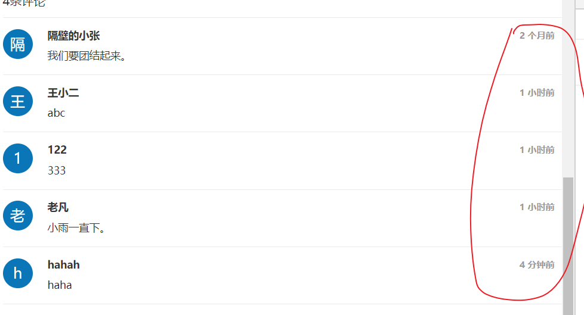
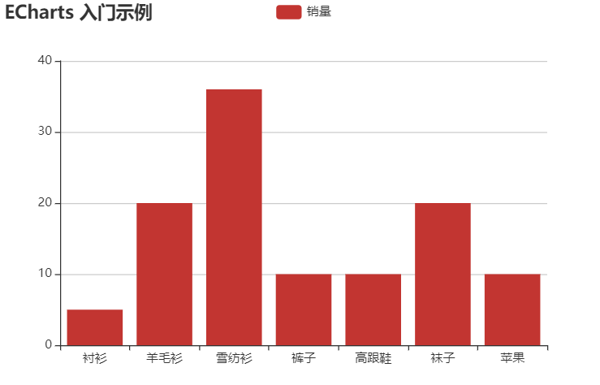

大事件


## day.js使用

[官网]( https://github.com/iamkun/dayjs/blob/dev/docs/zh-cn/README.zh-CN.md )


> Day.js 是一个轻量的处理时间和日期的 JavaScript 库，和 Moment.js 的 API 设计保持完全一样. 如果您曾经用过 Moment.js, 那么您已经知道如何使用 Day.js 

### 在浏览器端使用

引入js文件

```javascript
<script src="https://unpkg.com/dayjs"></script>
```

[api]( https://github.com/iamkun/dayjs/blob/master/docs/zh-cn/API-reference.md )

### 初始化

```javascript
// 接收可以解析传入的一个标准的ISO 8601时间字符串。
var ds = dayjs('1995-12-25')
// 可以解析传入的一个 Javascript Date 对象。
dayjs(new Date(2018, 8, 18))

// 接收 时间戳 (13 位数字)。
dayjs(1318781876406)
```

### 获取+设置

获取和改变日期。

获取或设置年份。

```
dayjs().year()
dayjs().year(2000)
```

获取或设置月份。从 0 开始

```
dayjs().month()
dayjs().month(0)
```

获取或设置日期。从 1 开始

```
dayjs().date()
dayjs().date(1)
```

获取或设置星期。从星期天 0 开始

```
dayjs().day()
dayjs().day(0)
```

获取或设置小时。

```
dayjs().hour()
dayjs().hour(12)
```

获取或设置分钟。

```
dayjs().minute()
dayjs().minute(59)
```

获取或设置秒。

```
dayjs().second()
dayjs().second(1)
```

获取或设置毫秒。

```
dayjs().millisecond()
dayjs().millisecond(1)
```


### 操作

您可以对 `Dayjs` 对象如下增加减少之类的操作：

```
dayjs()
  .startOf('month')
  .add(1, 'day')
  .subtract(1, 'year')
```

#### 增加

增加时间并返回一个新的 `Dayjs()` 对象。

```
dayjs().add(7, 'day');
```

#### 减少

减少时间并返回一个新的 `Dayjs()` 对象。

```
dayjs().subtract(7, 'year');
```

#### 开头时间

返回当前时间的开头时间的 `Dayjs()` 对象，如月份的第一天。

```
dayjs().startOf('week'); // 取决于 locale 文件里 `weekStart` 的值
```

#### 末尾时间

返回当前时间的末尾时间的 `Dayjs()` 对象，如月份的最后一天。

```
dayjs().endOf('month');
```

------

### 格式化

格式化 `Dayjs` 对象并展示。

```
dayjs().format(String)
dayjs('2019-01-25').format('[YYYY] YYYY-MM-DDTHH:mm:ssZ[Z]') // 'YYYY 2019-01-25T00:00:00-02:00Z'
dayjs().format('{YYYY} MM-DDTHH:mm:ssZ[Z]') // "{2014} 09-08T08:02:17-05:00Z"
```

详情如下:


| 格式   | 输出             | 描述                         |
| ------ | ---------------- | ---------------------------- |
| `YY`   | 18               | 两位数的年份                 |
| `YYYY` | 2018             | 四位数的年份                 |
| `M`    | 1-12             | 月份，从 1 开始              |
| `MM`   | 01-12            | 月份，两位数                 |
| `MMM`  | Jan-Dec          | 简写的月份名称               |
| `MMMM` | January-December | 完整的月份名称               |
| `D`    | 1-31             | 月份里的一天                 |
| `DD`   | 01-31            | 月份里的一天，两位数         |
| `d`    | 0-6              | 一周中的一天，星期天是 0     |
| `dd`   | Su-Sa            | 最简写的一周中一天的名称     |
| `ddd`  | Sun-Sat          | 简写的一周中一天的名称       |
| `dddd` | Sunday-Saturday  | 一周中一天的名称             |
| `H`    | 0-23             | 小时                         |
| `HH`   | 00-23            | 小时，两位数                 |
| `h`    | 1-12             | 小时, 12 小时制              |
| `hh`   | 01-12            | Hours, 12 小时制, 两位数     |
| `m`    | 0-59             | 分钟                         |
| `mm`   | 00-59            | 分钟，两位数                 |
| `s`    | 0-59             | 秒                           |
| `ss`   | 00-59            | 秒 两位数                    |
| `SSS`  | 000-999          | 毫秒 三位数                  |
| `Z`    | +05:00           | UTC 的偏移量                 |
| `ZZ`   | +0500            | UTC 的偏移量，数字前面加上 0 |
| `A`    | AM PM            |                              |
| `a`    | am pm            |                              |


```
<script>
  dayjs().format();
</script>
```

### 语言

默认情况下，它使用是英语包。

如果要设置成指定的语言，有两步

1. 引入对应的语言包
2. 设置`dayjs.locale`

```javascript
<script src="./js/dayjs.min.js"></script>
<script src="https://unpkg.com/dayjs/locale/zh-cn"></script>
<script>
  dayjs.locale('zh-cn') ; // 全局设置，中文
</script>
```

### 插件

插件可以增强它的功能。

步骤：

1. 引入对应的插件文件
2. 通过调用`dayjs.extend(dayjs_plugin_插件名)`，来集成插件的功能

```javascript
<script src="./js/dayjs.min.js"></script>
<script src="./js/utils/relative.min.js"></script>
<script>
	dayjs.extend(dayjs_plugin_relativeTime);
    dayjs(1580818968754).fromNow() //"34 分钟前"
	dayjs(1580818968754).to(Date.now()) //"35 分钟内"
editArticle
    
</script>
```


## 实践：用day.js来格式化显示用户评论中时间戳


```javascript
    <!-- 引入日期时间的js库 dayjs -->
    <script src="./js/dayjs/dayjs.min.js"></script>
    <script src="./js/dayjs/zh_cn.js"></script>
    <script src="./js/dayjs/relative.min.js"></script>
```


```javascript
<script>

        dayjs.locale('zh-cn') ; // 全局设置，中文
        // 使用插件
        dayjs.extend(dayjs_plugin_relativeTime);

		//...


		function getComment(){
            comment.get(id).then(function(res){
                if(res.code ==200){
                    // 对每一条留言中的dt进行格式化
                    // 具体就是从 时间戳 转成相对时间
+                    res.data.forEach(function(item){
                        // item.relativeTime = item.dt --->相对时间
                        // item.relativeTime = getRelativeTime(item.dt)
+                       item.relativeTime =  dayjs(item.dt).fromNow()        
                    })
                    console.log(res.data);
                    var htmlStr = template('tmp', res)
                    $('#comment_list').html( htmlStr )
                }
            })
        }
```




## lazyload.js

 https://appelsiini.net/projects/lazyload/ 

作用: 图片懒加载

原理:只有处在可见区域的图片，才会去加载图片。

步骤：

1. 引入js
2. 给图片加上一个data-src属性，来指向真实地址，src="占位图片"
3. lazyload();


示例：

```
<script src="https://cdn.jsdelivr.net/npm/lazyload@2.0.0-rc.2/lazyload.js"></script>


<script>
lazyload();
</script>
```

如果引入jquery,还可以  `$('图片').lazyload()`

## bootboxjs

 http://bootboxjs.com/getting-started.html 

 Bootbox.js旨在通过使用Bootstrap模态框更容易 。


它是基于bootstrap和jquery的一个弹出层插件。

 http://bootboxjs.com/examples.html#bb-confirm 


```javascript
引入jquery,bootstrap.js,bootstrap.css
<link rel="stylesheet" type="text/css" href="css/bootstrap.min.css">

<script src="./js/jquery-1.12.4.min.js"></script>
<script src="./js/bootstrap.min.js"></script>
<script src='https://cdnjs.cloudflare.com/ajax/libs/bootbox.js/5.3.3/bootbox.min.js'></script>


 bootbox.alert("不能为空");

// bootbox.confirm("你确定要删除吗？", function(result){ 
//     console.log('你的选择' + result); 
// });
```


## echart.js

[官网]( [https://www.echartsjs.com/zh/tutorial.html#5%20%E5%88%86%E9%92%9F%E4%B8%8A%E6%89%8B%20ECharts](https://www.echartsjs.com/zh/tutorial.html#5 分钟上手 ECharts) )



```javascript
<!DOCTYPE html>
<html lang="en">
<head>
    <meta charset="UTF-8">
    <meta name="viewport" content="width=device-width, initial-scale=1.0">
    <meta http-equiv="X-UA-Compatible" content="ie=edge">
    <title>Document</title>
</head>
<body>
    <!-- 为 ECharts 准备一个具备大小（宽高）的 DOM -->
    <div id="main" style="width: 600px;height:400px;"></div>

    <script src="./js/echarts.min.js"></script>
    <script type="text/javascript">
        // 基于准备好的dom，初始化echarts实例
        var myChart = echarts.init(document.getElementById('main'));

        // 指定图表的配置项和数据
        var option = {
            title: {
                text: 'ECharts 入门示例'
            },
            tooltip: {},
            legend: {
                data:['销量']
            },
            xAxis: {
                data: ["衬衫","羊毛衫","雪纺衫","裤子","高跟鞋","袜子","苹果"]
            },
            yAxis: {},
            series: [{
                name: '销量',
                type: 'bar',
                data: [5, 20, 36, 10, 10, 20,10]
            }]
        };

        // 使用刚指定的配置项和数据显示图表。
        myChart.setOption(option);
    </script>
</body>
</html>
```


### ajax求数据再画图

先取回数据，画图一定在在回调函数中去画。

```
1. 初始化，得到echart对象
// var myChart = echarts.init(document.getElementById('main'));
2. 设置options (画图所需的配置项)
   // 取回数据 去设置options中需要更改的数据。
3. 画图
// 使用刚指定的配置项和数据显示图表。
   myChart.setOption(option);

```


